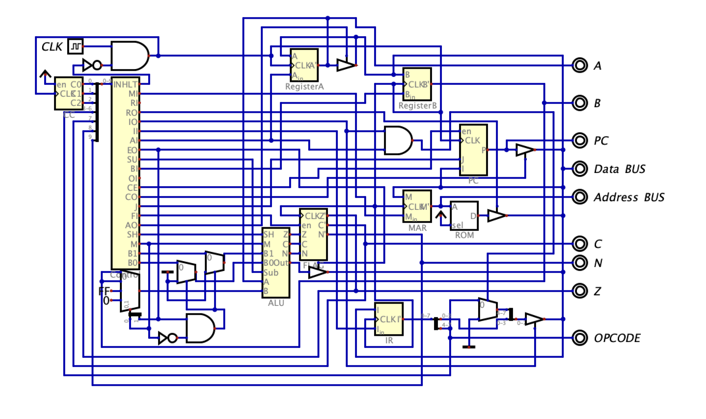
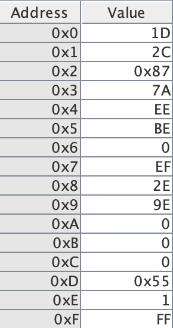
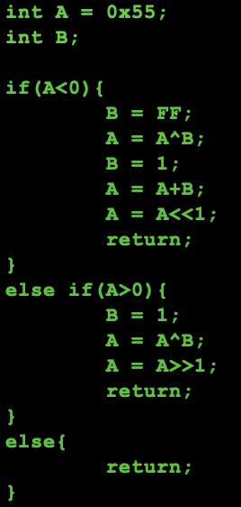
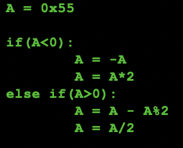
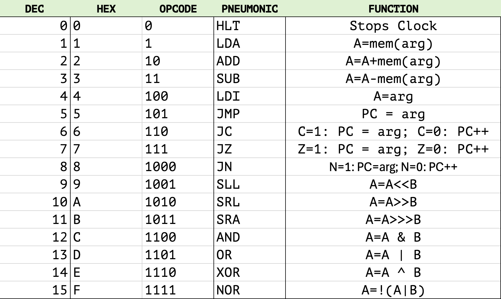
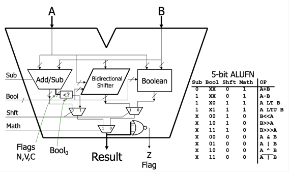

# SAPS (Simple-As-Possible-Shift)
A digital circuit representing a SAP architecture computer with an additional 4 ALUFN bits that implement SLL, SRA, SRL, and bitwise operations.

## Introduction

For a general overview of the Simple-As-Possible architecture, please see my SAP digital circuit or Jessie Wei's SAPsim. 

This 

## Example Program

## RAM

### RAM limitations

### SAPS Instruction Set

## ROM

### SAPS Microinstructions

## ALU

