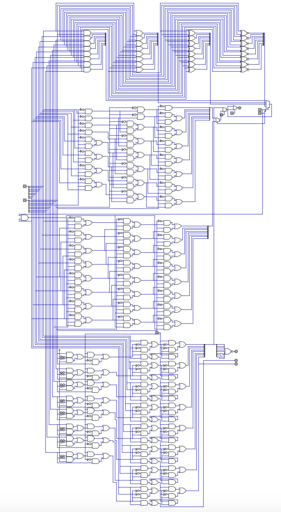

# SAP-S (Simple-As-Possible-Shift)
A digital circuit representing a SAP architecture computer with an additional 4 ALUFN bits that implement SLL, SRA, SRL, and bitwise operations.

## Introduction

For a general overview of the Simple-As-Possible architecture, please see my SAP digital circuit or Jessie Wei's SAPsim. This architecture is an extention thereof which executes simple arithmetic.

The SAP-S architecture is very similar, except it:
<ol>
  <li>Adds an N bit flag from the ALU which checks if the result is positive (0) or negative(1)</li>
  <li>Adds 7 new arithmetic instructions: logical shift left, logical shift right, arithmetic shift right, bitwise and, bitwise or, bitwise xor, and bitwise nor.</li>
  <li>Adds 1 new jump instruction, JN, which executes a jump iff the result from the ALU is negative.</li>
</ol> 

## Example Program

The following instructions are already loaded into the simulated RAM (ROM) module in the SAPS.dig file:

These instructions execute the following program:

And in pseudocode, this is what it does:

## SAPS Instruction Set

Below is the instruction set for the SAP-S computer. 

## Control

The control unit consists of a ROM module which decodes a 10-bit input to a 20-bit microinstruction. This output then decides which registers must read and write to and from the BUS for each of 5 clock cycles to perform the instruction. The inputs and corresponding microinstructions are included in the SAPS_MICROINSTRUCTIONS spreadsheet. It is hard to edit the microinstructions directly in the circuit, but you can use the comma delimited column to insert the data via the Control.dig file, where it is listed as an array. 

## ALU

The following picture shows the ALU of the SAP-S computer:

The function of the ALU is determined by 5 input bits: M (math), S (subtract), SH (shift), B1 (bool 1), B0 (bool 0). The basic function is shown in the following diagram:

